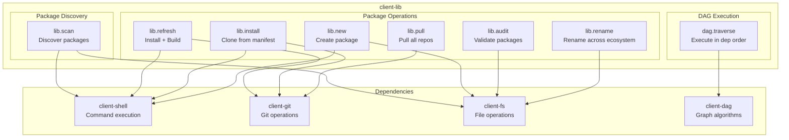
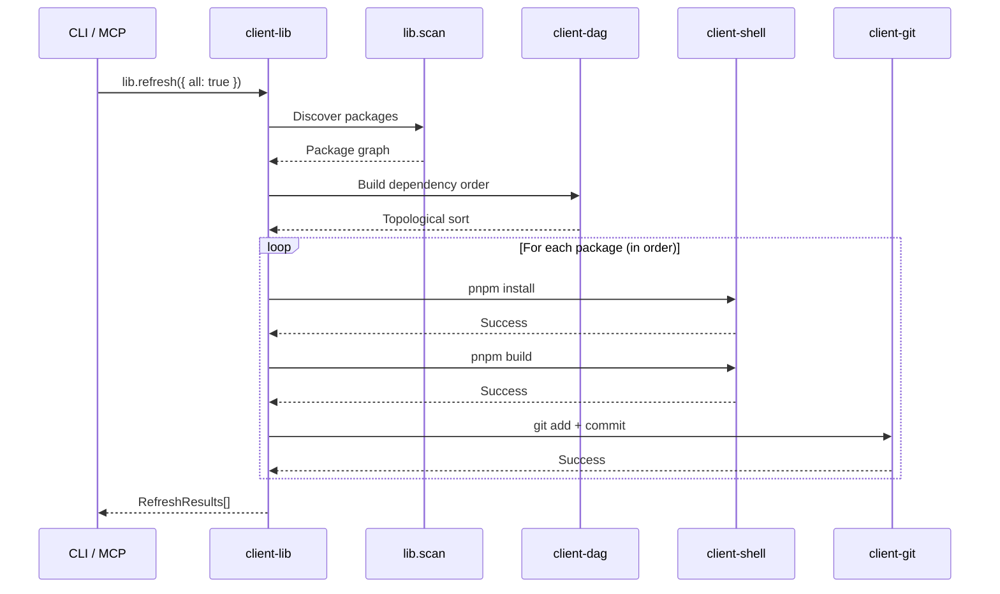
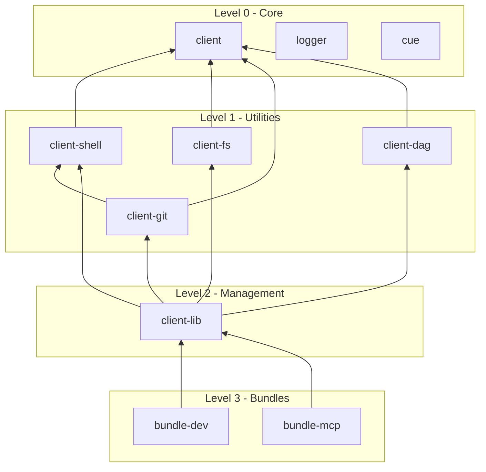
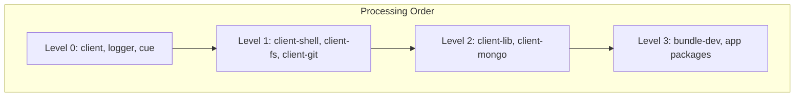

# @mark1russell7/client-lib

[](https://opensource.org/licenses/MIT)
[](https://www.typescriptlang.org/)
[](https://nodejs.org/)

> Ecosystem library management procedures. Scan, refresh, install, audit, and rename packages across the entire Mark ecosystem.

## Table of Contents

- [Overview](#overview)
- [Installation](#installation)
- [Architecture](#architecture)
- [Quick Start](#quick-start)
- [API Reference](#api-reference)
  - [lib.scan](#libscan)
  - [lib.refresh](#librefresh)
  - [lib.install](#libinstall)
  - [lib.new](#libnew)
  - [lib.audit](#libaudit)
  - [lib.rename](#librename)
  - [lib.pull](#libpull)
  - [dag.traverse](#dagtraverse)
- [DAG Execution](#dag-execution)
- [Integration](#integration)
- [Requirements](#requirements)
- [License](#license)

---

## Overview

**client-lib** provides procedures for managing the Mark ecosystem:

- **Package Discovery** - Scan `~/git` for ecosystem packages and build dependency graphs
- **Package Operations** - Create, refresh, install, audit, and rename packages
- **DAG Execution** - Execute procedures across packages in topological dependency order
- **Ecosystem Coordination** - Manage the entire ecosystem from a single entry point

---

## Installation

```bash
npm install github:mark1russell7/client-lib#main
```

---

## Architecture

### System Overview



### Procedure Call Flow



### Package Dependency Graph



---

## Quick Start

```typescript
import { Client } from "@mark1russell7/client";
import "@mark1russell7/client-lib/register";

const client = new Client({ /* transport */ });

// Scan for all ecosystem packages
const { packages } = await client.call(["lib", "scan"], {});

// Refresh all packages (install + build)
await client.call(["lib", "refresh"], {
  all: true,
  force: true,
});

// Create a new package
await client.call(["lib", "new"], {
  name: "my-new-package",
  preset: "lib",
});
```

---

## API Reference

### Procedures Summary

| Path | Description |
|------|-------------|
| `lib.scan` | Discover all ecosystem packages |
| `lib.refresh` | Install, build, and optionally commit packages |
| `lib.install` | Clone and build all packages from manifest |
| `lib.new` | Create a new package |
| `lib.audit` | Validate all packages against template |
| `lib.rename` | Rename a package across the codebase |
| `lib.pull` | Pull all packages from remote |
| `dag.traverse` | Execute a procedure across the DAG |

---

### lib.scan

Discover all ecosystem packages in ~/git.

```typescript
interface LibScanInput {
  rootPath?: string;     // Root path (default: ~/git)
}

interface PackageInfo {
  name: string;          // Package name
  repoPath: string;      // Absolute path
  gitRemote?: string;    // Git remote URL
  currentBranch?: string;
  mark1russell7Deps: string[];  // Ecosystem dependencies
}

interface LibScanOutput {
  packages: Record<string, PackageInfo>;
  warnings: Array<{ path: string; issue: string }>;
}
```

**Example:**
```typescript
const { packages, warnings } = await client.call(["lib", "scan"], {});
console.log(`Found ${Object.keys(packages).length} packages`);
```

---

### lib.refresh

Install dependencies, build, and optionally commit.

```typescript
interface LibRefreshInput {
  path?: string;         // Package path (default: ".")
  recursive?: boolean;   // Refresh dependencies first (default: false)
  all?: boolean;         // Refresh all packages (default: false)
  force?: boolean;       // Clean rebuild (default: false)
  skipGit?: boolean;     // Skip git operations (default: false)
  autoConfirm?: boolean; // Non-interactive (default: false)
  dryRun?: boolean;      // Preview only (default: false)
}

interface RefreshResult {
  name: string;
  path: string;
  success: boolean;
  duration: number;
  error?: string;
  failedPhase?: "cleanup" | "install" | "build" | "git";
}

interface LibRefreshOutput {
  success: boolean;
  results: RefreshResult[];
  totalDuration: number;
}
```

**CLI Usage:**
```bash
mark lib refresh -a -f  # Refresh all, force clean
mark lib refresh -r     # Refresh with dependencies
```

---

### lib.install

Clone and build all packages from ecosystem manifest.

```typescript
interface LibInstallInput {
  rootPath?: string;     // Root path (default: ~/git)
  dryRun?: boolean;      // Preview only (default: false)
  continueOnError?: boolean;  // Continue on failure (default: false)
  concurrency?: number;  // Parallel operations (default: 4)
}

interface LibInstallOutput {
  success: boolean;
  cloned: string[];      // Newly cloned packages
  skipped: string[];     // Already existed
  results: InstallResult[];
  errors: string[];
  totalDuration: number;
}
```

**Example:**
```typescript
// First-time ecosystem setup
const result = await client.call(["lib", "install"], {
  continueOnError: true,
  concurrency: 8,
});
console.log(`Cloned: ${result.cloned.length}, Skipped: ${result.skipped.length}`);
```

---

### lib.new

Create a new package with scaffolding.

```typescript
interface LibNewInput {
  name: string;          // Package name (without @mark1russell7/)
  preset?: string;       // Feature preset (default: "lib")
  rootPath?: string;     // Root path (default: ~/git)
  skipGit?: boolean;     // Skip git init (default: false)
  skipManifest?: boolean; // Skip manifest update (default: false)
  dryRun?: boolean;      // Preview only (default: false)
}

interface LibNewOutput {
  success: boolean;
  packageName: string;   // Full name (@mark1russell7/...)
  packagePath: string;   // Created path
  created: string[];     // Files created
  operations: string[];  // Operations performed
  errors: string[];
}
```

**CLI Usage:**
```bash
mark lib new my-package         # Create with default preset
mark lib new my-package -p app  # Create with app preset
```

---

### lib.audit

Validate all packages against the project template.

```typescript
interface LibAuditInput {
  rootPath?: string;     // Root path (default: ~/git)
  fix?: boolean;         // Fix issues (default: false)
}

interface PackageAuditResult {
  name: string;
  path: string;
  valid: boolean;
  missingFiles: string[];
  missingDirs: string[];
  pnpmIssues: PnpmIssue[];
  fixedFiles?: string[];
  fixedDirs?: string[];
}

interface LibAuditOutput {
  success: boolean;
  template: { files: string[]; dirs: string[] };
  results: PackageAuditResult[];
  summary: { total: number; valid: number; invalid: number };
}
```

---

### lib.rename

Rename a package across all ecosystem packages.

```typescript
interface LibRenameInput {
  oldName: string;       // Current package name
  newName: string;       // New package name
  rootPath?: string;     // Root path (default: ~/git)
  dryRun?: boolean;      // Preview only (default: false)
}

interface RenameChange {
  type: "package-name" | "dependency" | "import" | "dynamic-import";
  file: string;
  field?: string;
  line?: number;
  oldValue: string;
  newValue: string;
}

interface LibRenameOutput {
  success: boolean;
  changes: RenameChange[];
  errors: string[];
  summary: { packageNames: number; dependencies: number; imports: number; total: number };
}
```

---

### lib.pull

Pull all packages from their remotes.

```typescript
interface LibPullInput {
  rootPath?: string;     // Root path (default: ~/git)
  rebase?: boolean;      // Use rebase instead of merge (default: false)
}

interface LibPullOutput {
  success: boolean;
  results: Array<{ name: string; success: boolean; error?: string }>;
}
```

---

### dag.traverse

Execute a procedure on each package in dependency order.

```typescript
interface DagTraverseInput {
  visit: string[] | { $proc: string[]; input?: unknown };  // Procedure to call
  filter?: string[];     // Package name filter
  root?: string;         // Start from package
  concurrency?: number;  // Parallel ops (default: 4)
  continueOnError?: boolean;  // Continue on failure (default: false)
  dryRun?: boolean;      // Preview only (default: false)
}

interface DagTraverseOutput {
  success: boolean;
  results: TraverseNodeResult[];
  totalDuration: number;
  visited: number;
  failed: number;
}
```

**Example:**
```typescript
// Run tests on all packages in dependency order
await client.call(["dag", "traverse"], {
  visit: ["test", "run"],
  concurrency: 2,
});

// Build only packages that depend on client-fs
await client.call(["dag", "traverse"], {
  visit: { $proc: ["pnpm", "run"], input: { script: "build" } },
  root: "client-fs",
});
```

---

## DAG Execution

Packages are processed in topological dependency order, ensuring dependencies are built before dependents:



**Concurrency:** Within each level, packages with no cross-dependencies are processed in parallel.

---

## Integration

### With CLI

```bash
# The mark CLI uses client-lib internally
mark lib scan      # → lib.scan
mark lib refresh   # → lib.refresh
mark lib new       # → lib.new
```

### With MCP (Claude)

When using the MCP server, Claude can:
- Create new packages: "Create a new package called client-redis"
- Refresh ecosystem: "Rebuild all packages"
- Audit packages: "Check if all packages are valid"

### With Other Packages

```typescript
// client-lib depends on these packages
import "@mark1russell7/client-shell/register";  // Command execution
import "@mark1russell7/client-git/register";    // Git operations
import "@mark1russell7/client-fs/register";     // File operations
import "@mark1russell7/client-dag/register";    // DAG algorithms
```

---

## Requirements

- **Node.js** >= 20
- **pnpm** >= 8.0
- **Git** >= 2.30
- **Dependencies:**
  - `@mark1russell7/client`
  - `@mark1russell7/client-shell`
  - `@mark1russell7/client-git`
  - `@mark1russell7/client-fs`
  - `@mark1russell7/client-dag`

---

## License

MIT
